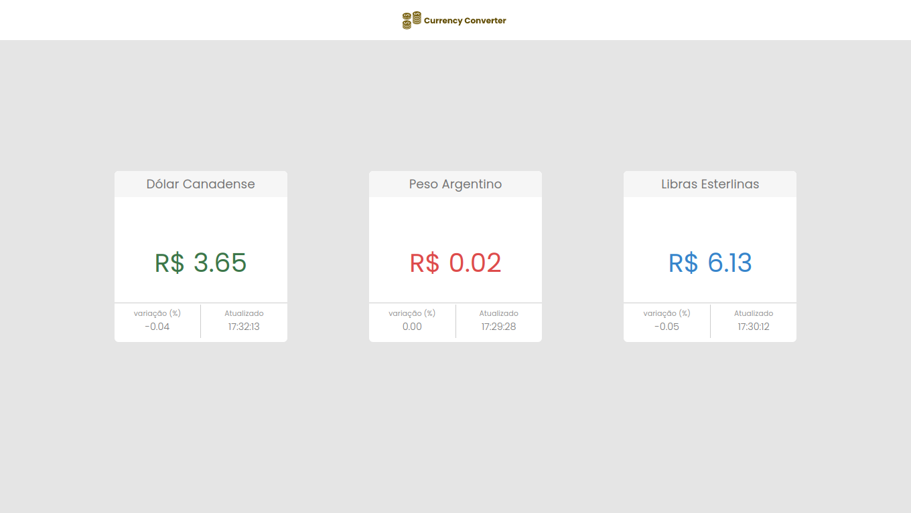

# Currancies Exchange Project :dollar: :euro: 💴

This aplication was developed to bring to the user the updated quotation of three currancies converted to brazilian real currancy. 
In this SPA (single page application) the user have acess to the values of canadian dollar, argentinian peso and pounds all converted to brazilian real and it's also possible to see new updated quotations every 3 minutes, containing also its variation in percentage. Furthermore, the application was developed for web and mobile versions.

:computer: Developement tecnologies 
:small_blue_diamond: Angular  
:small_blue_diamond: TypeScript  
:small_blue_diamond: Docker   
:paintbrush: For styling: 
:small_blue_diamond: SASS

## Instructions

:arrow_right: Without Docker: 
:small_blue_diamond: Clone or download the repository to you computer, open the terminal and run the following code in the repository root: "npm install" 

:small_blue_diamond: After installing the dependencies, you can run "npm start" in the terminal to open the project in localhost, pasting the given link in you browser navigation bar.  

:arrow_right: With Docker: 

:exclamation: To run de application in a docker container, the user must have docker installed in his computer. 
:small_blue_diamond: Clone or download the repository to you computer 
:small_blue_diamond: In the terminal, run: "docker-compose up" to put the container up; 
:small_blue_diamond: Paste on your browser navigation bar the link giver by the terminal (http://localhost:4200)

## Demonstration
:small_blue_diamond: To use the aplication, you can access the deploy link [HERE](https://currancy-exchange-frete-rapido.vercel.app/) 

